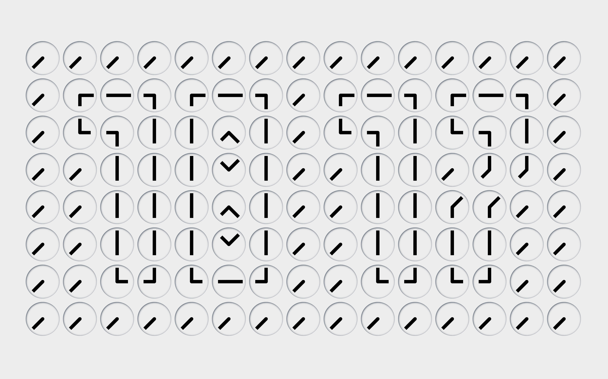

# clock by [@makenowjust][]

> A simple clock that displays the current time in a unique way, inspired by [Humans Since 1982](https://www.youtube.com/watch?v=IA4UsV04bnM).

Also, this project is inspired by the [@akira888](https://github.com/akira888)'s [talk](https://speakerdeck.com/akira888/hutuunoji-shu-sutatukudeatozuo-pin-wozuo-tutemiru) at [Kansai RubyKaigi 08](https://regional.rubykaigi.org/kansai08/).

## License

This project is licensed under the CC-BY 4.0 license.
See [LICENSE](LICENSE) for details.

(C) 2025 Hiroya Fujinami (a.k.a. [@makenowjust][])

[@makenowjust]: https://github.com/makenowjust